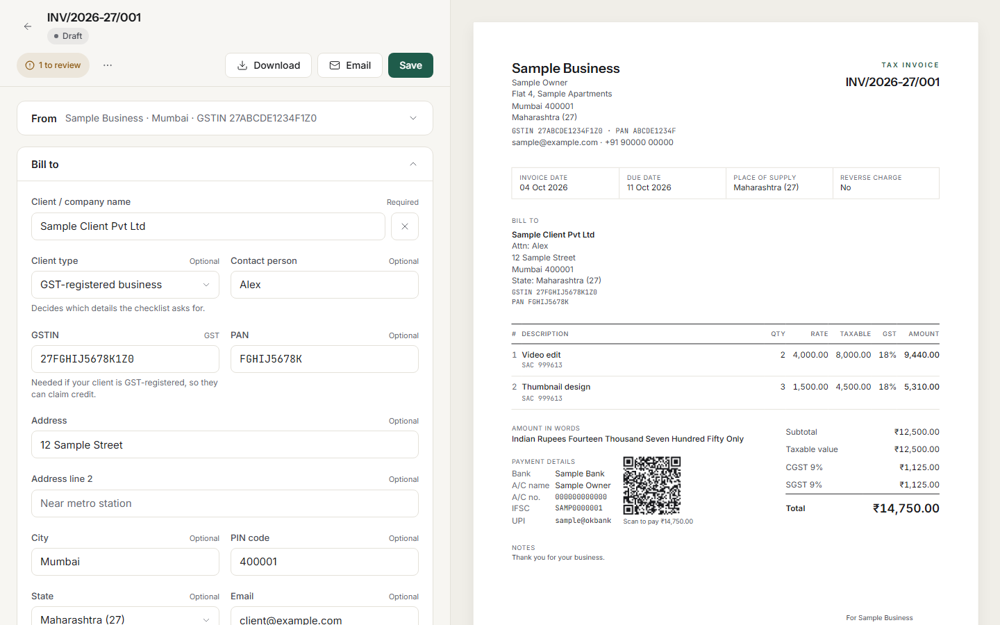
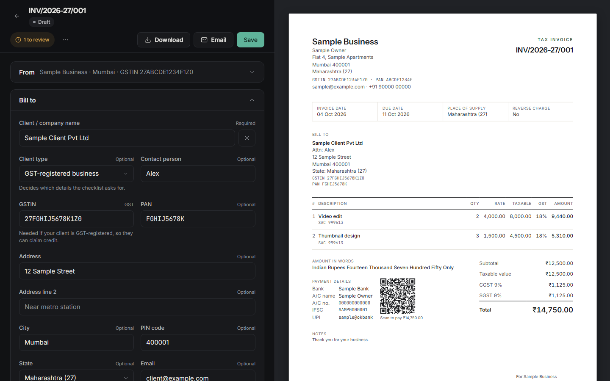
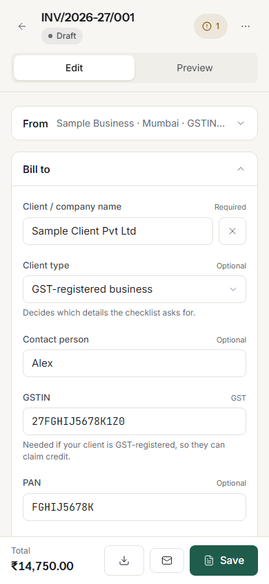
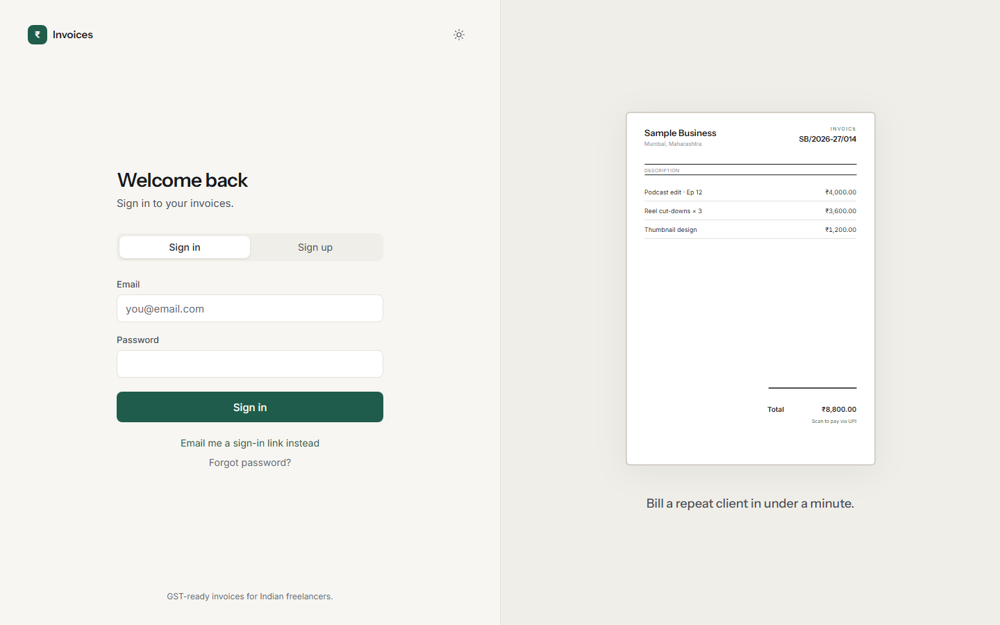

# Invoices

A GST-ready invoicing app for Indian freelancers, built to be read and learned from. Sign in, set up your business once, then create invoices in a split-screen editor with a live A4 preview, and download them as vector PDFs.

> All names, addresses, GSTINs, PANs, bank and UPI details in this repository, its tests and its screenshots are made-up sample data.



<p>
  
  
  
</p>

## What it does

- Follows Indian GST invoice rules (Rule 46, CGST Rules 2017) without forcing optional fields: a missing GSTIN or address never blocks saving, previewing or downloading. A checklist shows what is recommended.
- Remembers your clients and services. Type "V" and it suggests "Video edit" with price, SAC and GST rate filled in.
- CGST + SGST or IGST is picked automatically from the place of supply. Amounts are stored as integer paise, never floats.
- Live A4 preview that matches the downloaded vector PDF (same data, same calculation function).
- UPI QR code on the invoice, bank details, optional TDS line, round-off, amount in words.
- Dashboard, invoice list with filters and bulk select, payments, clients, item library, CSV/JSON export, Ctrl+K command menu.
- One status control per invoice (Draft, Sent, Paid, with Partially paid and Cancelled under More).
- Email button: creates a Gmail draft with the PDF attached (after "Connect Gmail" in Settings > Email), or falls back to a download plus a private 30-day link and Gmail compose.
- Light and dark themes, keyboard friendly, respects `prefers-reduced-motion`.

## Tech stack

Next.js 16 (App Router) · React 19 · TypeScript (strict) · Tailwind CSS 4 · Supabase (Postgres, Auth, Storage, Row Level Security) · `@react-pdf/renderer` · react-hook-form + Zod · Motion / Lenis / GSAP · Vitest + Playwright · deployed on Vercel.

Design and architecture notes are in [`docs/`](docs): product spec, design system, architecture and database schema, and the India GST compliance rules.

## Run it yourself

You need Node.js 20.9 or newer, a free [Supabase](https://supabase.com) account, and optionally a Google Cloud project (for Gmail drafts) and a [Vercel](https://vercel.com) account.

```bash
git clone <this repo>
cd <this repo>
npm install
cp .env.example .env.local     # then fill it in, see the next sections
npm run dev                    # http://localhost:3000
```

The app will not start without `NEXT_PUBLIC_SUPABASE_URL` and `NEXT_PUBLIC_SUPABASE_ANON_KEY`.

### 1. Create your Supabase project

1. In Supabase, create a new project (pick the region closest to you) and wait for it to finish provisioning.
2. Open **Project Settings → API** and copy the **Project URL** and the **`anon` public key**. These go in `NEXT_PUBLIC_SUPABASE_URL` and `NEXT_PUBLIC_SUPABASE_ANON_KEY`.
3. Open **SQL Editor → New query**, paste each file from [`supabase/migrations/`](supabase/migrations) **in this order**, and press Run:

   | # | File | What it does |
   |---|---|---|
   | 1 | `0001_schema.sql` | Tables (profiles, clients, items, invoices, invoice lines, payments), Row Level Security on every table, helper functions (`save_invoice`, `record_items`, payment trigger), the private `branding` storage bucket |
   | 2 | `0002_email_and_pdfs.sql` | Private `invoice-pdfs` bucket (owner-only) and the email template columns |
   | 3 | `0003_gmail_drafts.sql` | `gmail_connections` table (encrypted refresh token, RLS) and the fallback email template column |

   Every file is safe to run again. Each ends with a check query that shows the result.
4. Open **Authentication → URL Configuration**:
   - **Site URL:** `http://localhost:3000` while developing (your Vercel URL in production)
   - **Redirect URLs:** add `http://localhost:3000/auth/callback` and `http://localhost:3000/auth/reset`, plus the same two paths on your production URL.
5. Optional: in **Authentication → Providers → Email**, turn **Confirm email** off while you are only testing locally, so sign-up does not wait for an email link.
6. Optional: to show "Continue with Google" on the login page, enable the Google provider in Supabase Auth, then set `NEXT_PUBLIC_ENABLE_GOOGLE=true`.

Row Level Security is on for every table and every row belongs to one user (`user_id`), so the `anon` key is safe to expose in the browser. The service-role key is **not** needed by the app and must never get a `NEXT_PUBLIC_` prefix.

### 2. Gmail drafts (optional)

Without this, the Email button still works through the download + Gmail compose fallback, and the Connect Gmail button stays disabled.

1. Google Cloud console → create a project → enable the **Gmail API**.
2. **Auth Platform** → set up the consent screen (External), add yourself as a **test user**, and add the single scope `https://www.googleapis.com/auth/gmail.compose`. It can create drafts; it cannot read mail.
3. **Credentials → Create credentials → OAuth client ID → Web application.** Add these authorised redirect URIs:
   - `http://localhost:3000/api/gmail/callback`
   - `https://your-app.vercel.app/api/gmail/callback`
4. Put the client ID and secret in `GOOGLE_CLIENT_ID` and `GOOGLE_CLIENT_SECRET`, and generate the encryption key for `GMAIL_TOKEN_KEY`:

   ```bash
   node -e "console.log(require('crypto').randomBytes(32).toString('base64'))"
   ```
5. Restart the app, then go to **Settings → Email → Connect Gmail**.

While the Google app is in *Testing* mode, Google expires the connection every 7 days: connect again, or publish the app (it shows an "unverified app" screen that only you will see).

### 3. Deploy to Vercel

1. Push your copy of this repo to GitHub and import it in Vercel (framework preset: Next.js).
2. Add every environment variable from the table below in **Project → Settings → Environment Variables**. Set `NEXT_PUBLIC_SITE_URL` to your production URL, for example `https://your-app.vercel.app`.
3. Deploy. Then add your production URL to Supabase **Authentication → URL Configuration** (Site URL and the two redirect URLs above) and, if you use Gmail, to the Google OAuth redirect URIs.
4. Speed tip: Vercel runs functions in one region. Choose the one closest to your Supabase project (Project → Settings → Functions → Region, or `"regions"` in `vercel.json`), because every page makes several database calls.

## Environment variables

Copy `.env.example` to `.env.local` locally, or add these in Vercel. Real values never go in git: `.env*` is git-ignored except `.env.example`, which has empty values.

| Name | Required | Value |
|---|---|---|
| `NEXT_PUBLIC_SUPABASE_URL` | yes | Supabase → Project Settings → API → Project URL (`https://YOUR_PROJECT_ID.supabase.co`) |
| `NEXT_PUBLIC_SUPABASE_ANON_KEY` | yes | Supabase → Project Settings → API → `anon` public key |
| `NEXT_PUBLIC_SITE_URL` | recommended | Where the app is served: `http://localhost:3000` locally, `https://your-app.vercel.app` in production. Used to build auth email links. If empty, it is taken from the request host |
| `NEXT_PUBLIC_ENABLE_GOOGLE` | no | `true` to show "Continue with Google" (needs the Google provider set up in Supabase Auth). Default `false` |
| `GOOGLE_CLIENT_ID` | for Gmail | Google Cloud OAuth client ID. Server only |
| `GOOGLE_CLIENT_SECRET` | for Gmail | Google Cloud OAuth client secret. Server only |
| `GMAIL_TOKEN_KEY` | for Gmail | 32 random bytes, base64 (command above). Encrypts the stored Gmail refresh token. Server only. Losing it means users reconnect Gmail |
| `SUPABASE_SERVICE_ROLE_KEY` | no | **Not used by the app.** Only some end-to-end tests read it, to check that deleted files are really gone. Keep it out of the browser and out of git |
| `PERF_LOG` | no | `1` logs every timed server call; by default only calls slower than 300 ms are logged (`[slow] ...`) |
| `E2E_EMAIL`, `E2E_PASSWORD`, `E2E_NEW_EMAIL`, `E2E_BASE_URL` | tests only | See "Tests" below |

## Development

```bash
npm run dev          # http://localhost:3000
npm run lint
npm run typecheck
npm test             # unit tests: invoice maths, validators, numbering, email templates
npm run test:e2e     # Playwright, needs a migrated Supabase project (see below)
npm run build
npm run format       # Prettier
```

### Tests

- **Unit tests** (`tests/unit`, Vitest) need nothing but `npm install`. They cover the GST maths, amount in words, invoice numbering, document type rules, GSTIN/PAN/IFSC/UPI validators and the email templates.
- **End-to-end tests** (`tests/e2e`, Playwright) run against a real Supabase project with the migrations applied, so use a throwaway one. Install the browsers once with `npx playwright install`, create a confirmed test user and finish its onboarding, then:

  ```bash
  E2E_EMAIL=you@example.com E2E_PASSWORD=... npm run test:e2e
  ```

  The sign-up flow test also needs `E2E_NEW_EMAIL` and Supabase "Confirm email" turned off. Without these variables those tests skip. The tests run on the production build, so run `npm run build` first.

### Regenerating database types

`src/types/database.ts` is hand-written to match the migrations. To regenerate it from your project instead, run `npx supabase login`, replace `YOUR_PROJECT_ID` in the `db:types` script in `package.json` with your project reference, then `npm run db:types`.

## Project layout

```
src/app/            routes: (auth) login/reset, (app) dashboard/invoices/clients/items/settings, onboarding, api (export, gmail)
src/components/     invoice editor + preview + PDF, shell (sidebar, command menu), profile forms, ui primitives
src/lib/invoice/    the calculation function, GST rules, numbering, amount in words, email templates
src/lib/validation/ Zod schemas and Indian identifier checks (GSTIN checksum, PAN, IFSC, UPI)
src/lib/supabase/   server, browser and proxy clients
src/lib/gmail/      OAuth, token encryption, MIME builder for drafts
supabase/migrations SQL, run in order
tests/              unit (Vitest) and e2e (Playwright)
docs/               product, design system, architecture, India compliance
```

## Disclaimer

This is a learning project, not tax or legal advice. Check invoice requirements with your accountant before relying on it for GST filings.

## License

[MIT](LICENSE)
